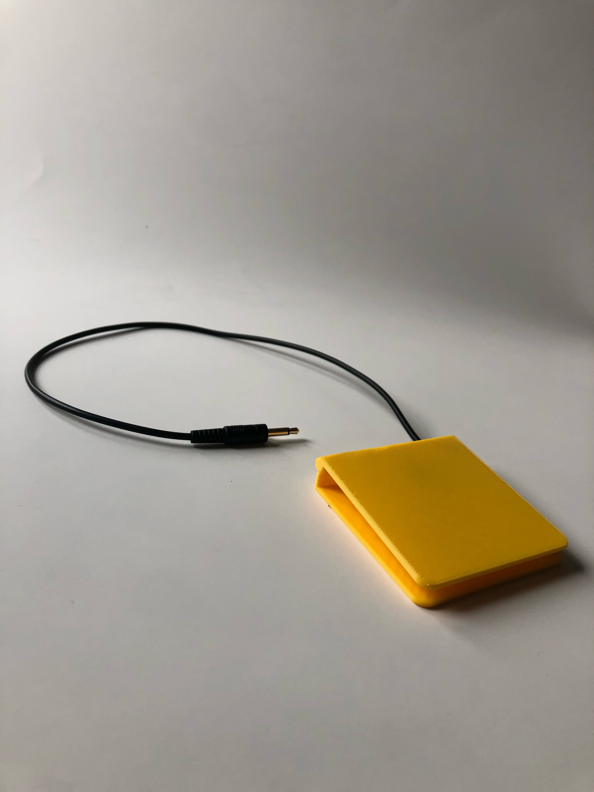

# Low-Profile-Switch
A low force hand operated switch

## More info at
- [Makers Making Change Project Page](https://makersmakingchange.com/project/low-profile-switch/)

## Getting Started
1. How to build this device

All of the files and instructions required to build the Low Profile Switch are contained within this repository. Refer to the Maker Checklist below.

2. How to request a build of this device

If you would like to obtain a Low Profile Switch but do not have the skills or equipment to do so, you may submit a build request through the [MMC Library Page](https://makersmakingchange.com/project/low-profile-switch/). The requestor is responsible for the cost of materials and any shipping.

3. How to build this device for someone else

If you have the skills and equipment to build this device, and would like to donate your time to create the switch for someone who needs it, visit the [MMC Maker Wanted](https://makersmakingchange.com/maker-wanted/) section.

## Files

### Documentation
| Document             | Version | Link                                                                                  |
|----------------------|---------|---------------------------------------------------------------------------------------|
| Maker Checklist      | 1.0     | [Maker Checklist](/Documentation/Low_Profile_Switch_Maker_Checklist_v1.0.pdf)         |
| Bill of Materials    | 1.0     | [BOM](/Documentation/Low_Profile_Switch_BOM_V1.0.xlsx)                                |
| 3D Printing Guide    | 1.0     | [3D Printing Guide](Documentation/Low_Profile_Switch_3D_Printing_Guide_v1.0.pdf)             |
| Assembly Guide       | 1.0     | [Assembly Guide](/Documentation/Low_Profile_Switch_Assembly_Guide_v1.0.pdf)           |      
| User Quick Guide     | 1.0     | [Quick_Guide](/Documentation/Low_Profile_Switch_User_Guide_v1.0.pdf)                  |

## Attribution 

Designed by Kerilyn Kennedy - Makers Making Change.
Documentation created by Neil Squire / Makers Making Change.
 

## License 
Everything needed or used to design, make, test, or prepare the Low Profile Switch is licensed under the CERN 2.0 Permissive license <https://ohwr.org/project/cernohl/wikis/Documents/CERN-OHL-version-2> (CERN-OHL-P) . 

 
Accompanying material such as instruction manuals, videos, and other copyrightable works that are useful but not necessary to design, make, test, or prepare the Low Profile Switch are published under a Creative Commons Attribution-ShareAlike 4.0 license <https://creativecommons.org/licenses/by-sa/4.0/> (CC BY-SA 4.0) 
 

 ----
<!-- ABOUT MMC START -->
## About Makers Making Change

Makers Making Change is a program of [Neil Squire](https://www.neilsquire.ca/), a Canadian non-profit that uses technology, knowledge, and passion to empower people with disabilities.

Makers Making Change leverages the capacity of community based Makers, Disability Professionals and Volunteers to develop and deliver affordable Open Source Assistive Technologies.

 - Website: [www.MakersMakingChange.com](https://www.makersmakingchange.com/)
 - GitHub: [makersmakingchange](https://github.com/makersmakingchange)
 - Bluesky: [@makersmakingchange.bsky.social](https://bsky.app/profile/makersmakingchange.bsky.social)
 - Instagram: [@makersmakingchange](https://www.instagram.com/makersmakingchange)
 - Facebook: [makersmakechange](https://www.facebook.com/makersmakechange)
 - LinkedIn: [Neil Squire Society](https://www.linkedin.com/company/neil-squire-society/)
 - Thingiverse: [makersmakingchange](https://www.thingiverse.com/makersmakingchange/about)
 - Printables: [MakersMakingChange](https://www.printables.com/@MakersMakingChange)

### Contact Us
For technical questions, to get involved, or to share your experience we encourage you to [visit our website](https://www.makersmakingchange.com/) or [contact us](https://www.makersmakingchange.com/s/contact).
<!-- ABOUT MMC END -->
